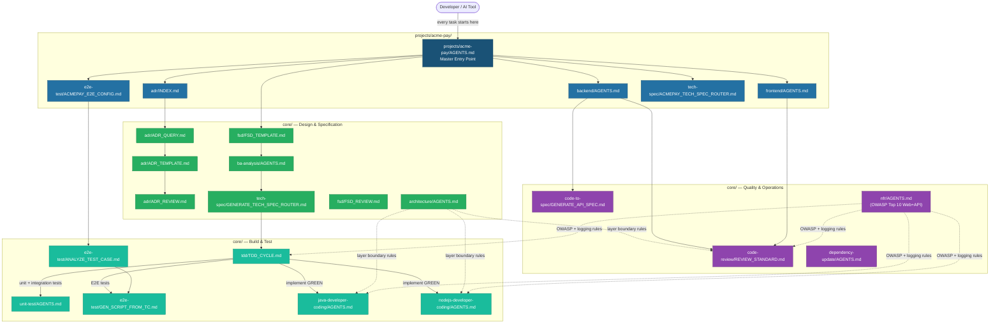

# Multi-Agent AI Automation Framework

A structured, reusable library of AI agent definitions, prompt files, and project-specific configurations for automating software engineering tasks across multiple projects.

**New here? Start with [QUICKSTART.md](QUICKSTART.md) — onboard your project in under 10 minutes.**

---

## Directory Layout

```
agent-framework/
├── core/                        # Project-agnostic agents and prompts
│   ├── adr/                     # Architecture Decision Records (template, review, query)
│   ├── architecture/            # Hexagonal and Microservice pattern rules and checklists
│   ├── fsd/                     # Functional Specification Document template and review
│   ├── ba-analysis/             # Business analysis: user stories, acceptance criteria
│   ├── tech-spec/               # Technical specification generation (API, Batch, DB)
│   ├── tdd/                     # TDD workflow: Red→Green→Refactor cycle
│   ├── unit-test/               # Unit test generation (JUnit, Playwright)
│   ├── e2e-test/                # E2E test analysis, script generation
│   ├── java-developer-coding/   # Spring Boot development coding standards
│   ├── nodejs-developer-coding/ # Node.js / TypeScript / Express coding standards
│   ├── code-review/             # Code review standards and checklists
│   ├── code-to-spec/            # Generate Confluence specs from source code
│   ├── dependency-update/       # Automated Java dependency update process
│   ├── nfr/                     # NFR: logging, OWASP Top 10 (Web + API), security, K8s
│   └── tech-stack/              # Reference technology stack and architectural patterns
│
├── projects/
│   └── acme-pay/                # Example: ACME payment processing system
│       ├── AGENTS.md            # Master entry point for acme-pay
│       ├── fsd/                 # Functional Specification Documents for this project
│       ├── backend/             # Spring Boot 3 / Java 17 backend
│       ├── frontend/            # React 18 / TypeScript / MUI v6 frontend
│       ├── e2e-test/            # Project-specific E2E config and scripts
│       └── tech-spec/           # Project-specific tech spec prompts
│           └── templates/       # Confluence HTML templates
│
├── integrate-agent/             # Tool integration guides
│   ├── claude-code/             # Claude Code (CLI / IDE extension)
│   ├── github-copilot/          # GitHub Copilot Chat (VS Code / JetBrains)
│   ├── openai-codex/            # OpenAI Codex / ChatGPT (API + chat UI)
│   └── generic-llm/             # Any LLM — portable baseline + tool comparison
│
└── shared/
    └── templates/               # Shared HTML/XML templates across projects
```

---

## Architecture in Plain Language

Three layers, one rule: **generic logic lives in `core/`, project-specific data lives in `projects/`, shared assets live in `shared/`.**

- **`core/`** — prompt files that work for *any* project. No table names, no service URLs, no error codes hardcoded. Uses `{{PLACEHOLDER}}` variables instead.
- **`projects/acme-pay/`** — fills those placeholders with real project values: database table names, error codes, Confluence space keys. Extends core, never duplicates it.
- **`shared/`** — HTML/MD templates and the data dictionary used by both layers.
- **`integrate-agent/`** — shows how to wire the framework into Claude Code, Copilot, OpenAI API, or any LLM.

When another team onboards (e.g., `projects/trade-finance/`), they copy the `projects/acme-pay/` pattern and fill it with their own constants. The `core/` prompts need zero changes.

---

## Context & Navigation Map

The diagram below shows how the framework modules connect. Arrows mean "load this context before running" or "routes to".



**Legend:**
- **Dark blue** — master entry point (`projects/acme-pay/AGENTS.md`), always load first
- **Mid blue** — project sub-module files (backend, frontend, e2e config, ADR index)
- **Green** — `core/` Design & Specification modules (ADR, FSD, BA Analysis, Tech Spec)
- **Teal** — `core/` Build & Test modules (TDD cycle, unit tests, E2E, coding standards)
- **Purple** — `core/` Quality & Operations modules (code review, code-to-spec, NFR, dependency update)

### How to Read the Diagram

Each path through the diagram is a **loading order recipe**. Trace from the master entry point down to know which files to load before running a prompt.

---

## TDD Workflow — End-to-End

The framework follows a strict **FSD → Test → Code** sequence: FSD → BA Analysis → Tech Spec → Test Cases (RED) → Implementation (GREEN) → Refactor → Code Review → E2E Report. Each step's output is the next step's input — tests are written and committed **before** production code.

See [`core/tdd/AGENTS.md`](core/tdd/AGENTS.md) for the full phase-by-phase breakdown and rules.

---

## How to Use

Every task follows the same two-step pattern regardless of AI tool:

1. **Load** `projects/<your-project>/AGENTS.md` — always first; defines all constants, architecture rules, and placeholder values.
2. **Load and run** the target prompt file — fill all `{{PLACEHOLDER}}` variables from step 1.

Identify the right prompt from the Agent Index below, then follow the tool-specific guide in `integrate-agent/` for the exact syntax.

---

## Agent Index

### Core Agents (project-agnostic)

| Agent | Path | Use When |
|---|---|---|
| ADR | [`core/adr/AGENTS.md`](core/adr/AGENTS.md) | Author, review, or query Architecture Decision Records |
| Architecture | [`core/architecture/AGENTS.md`](core/architecture/AGENTS.md) | Enforce Hexagonal or Microservice layer boundaries during design, coding, and review |
| FSD | [`core/fsd/AGENTS.md`](core/fsd/AGENTS.md) | Author or review a Functional Specification Document |
| BA Analysis | [`core/ba-analysis/AGENTS.md`](core/ba-analysis/AGENTS.md) | Transform FSD into user stories and acceptance criteria |
| Tech Spec | [`core/tech-spec/AGENTS.md`](core/tech-spec/AGENTS.md) | Generate API, Batch, or Database technical specifications from FSD |
| TDD | [`core/tdd/AGENTS.md`](core/tdd/AGENTS.md) | Run Red→Green→Refactor cycle; enforce test-first development |
| Unit Test | [`core/unit-test/AGENTS.md`](core/unit-test/AGENTS.md) | Generate JUnit 5 backend tests or Playwright frontend tests |
| E2E Test | [`core/e2e-test/AGENTS.md`](core/e2e-test/AGENTS.md) | Analyze test cases and generate Playwright scripts |
| Java Developer Coding | [`core/java-developer-coding/AGENTS.md`](core/java-developer-coding/AGENTS.md) | Write new Spring Boot code following project standards |
| Node.js Developer Coding | [`core/nodejs-developer-coding/AGENTS.md`](core/nodejs-developer-coding/AGENTS.md) | Write new Node.js / TypeScript code following project standards |
| Code Review | [`core/code-review/AGENTS.md`](core/code-review/AGENTS.md) | Review a branch for performance, code smell, security, and test coverage |
| Code to Spec | [`core/code-to-spec/AGENTS.md`](core/code-to-spec/AGENTS.md) | Generate a Confluence API spec from existing Spring Boot source code |
| Dependency Update | [`core/dependency-update/AGENTS.md`](core/dependency-update/AGENTS.md) | Automatically update Java library versions across multiple repos |
| NFR | [`core/nfr/AGENTS.md`](core/nfr/AGENTS.md) | Non-Functional Requirements: logging, OWASP Top 10 (Web + API), security, Kubernetes |
| Tech Stack | [`core/tech-stack/AGENTS.md`](core/tech-stack/AGENTS.md) | Reference architecture and technology stack patterns |

### Example Project Agents (acme-pay)

| Agent | Path | Use When |
|---|---|---|
| acme-pay Master | [`projects/acme-pay/AGENTS.md`](projects/acme-pay/AGENTS.md) | Starting point for any acme-pay task |
| acme-pay Backend | [`projects/acme-pay/backend/AGENTS.md`](projects/acme-pay/backend/AGENTS.md) | Write or review Spring Boot backend code |
| acme-pay Frontend | [`projects/acme-pay/frontend/AGENTS.md`](projects/acme-pay/frontend/AGENTS.md) | Write or review React frontend code |
| acme-pay Tech Spec | [`projects/acme-pay/tech-spec/ACMEPAY_TECH_SPEC_ROUTER.md`](projects/acme-pay/tech-spec/ACMEPAY_TECH_SPEC_ROUTER.md) | Generate API, Batch, or DB technical specs and Confluence pages |
| acme-pay E2E Test | [`projects/acme-pay/e2e-test/ACMEPAY_E2E_CONFIG.md`](projects/acme-pay/e2e-test/ACMEPAY_E2E_CONFIG.md) | Run Playwright tests and update Excel results |

### Tool Integration

| Tool | Guide | Use When |
|---|---|---|
| Claude Code | [`integrate-agent/claude-code/GUIDE.md`](integrate-agent/claude-code/GUIDE.md) | Agentic multi-file edits, hooks, CI via `claude -p` |
| GitHub Copilot | [`integrate-agent/github-copilot/GUIDE.md`](integrate-agent/github-copilot/GUIDE.md) | Inline editor chat with `#file:` and `@workspace` |
| OpenAI / ChatGPT | [`integrate-agent/openai-codex/GUIDE.md`](integrate-agent/openai-codex/GUIDE.md) | API automation pipelines or ChatGPT chat UI |
| Any LLM | [`integrate-agent/generic-llm/GUIDE.md`](integrate-agent/generic-llm/GUIDE.md) | Portable baseline; tool comparison table |

---

## Naming Conventions

| Artifact | Convention | Example |
|---|---|---|
| Folders | kebab-case | `code-to-spec/`, `e2e-test/` |
| Agent files | `AGENTS.md` (uppercase) | `AGENTS.md` |
| Prompt files | `UPPER_SNAKE_CASE.md` | `GENERATE_API_TECH_SPEC.md` |
| HTML templates | kebab-case | `confluence-template-api.html` |

---

## Onboarding a New Project or Core Module

See **[QUICKSTART.md](QUICKSTART.md)** for step-by-step instructions on adding a new project and the quality gate checklist. Adding a new core module follows the same pattern — create `core/<module-name>/AGENTS.md` + at least one `UPPER_SNAKE_CASE.md` prompt using `{{PLACEHOLDERS}}` only, then test with two different project contexts before committing.
