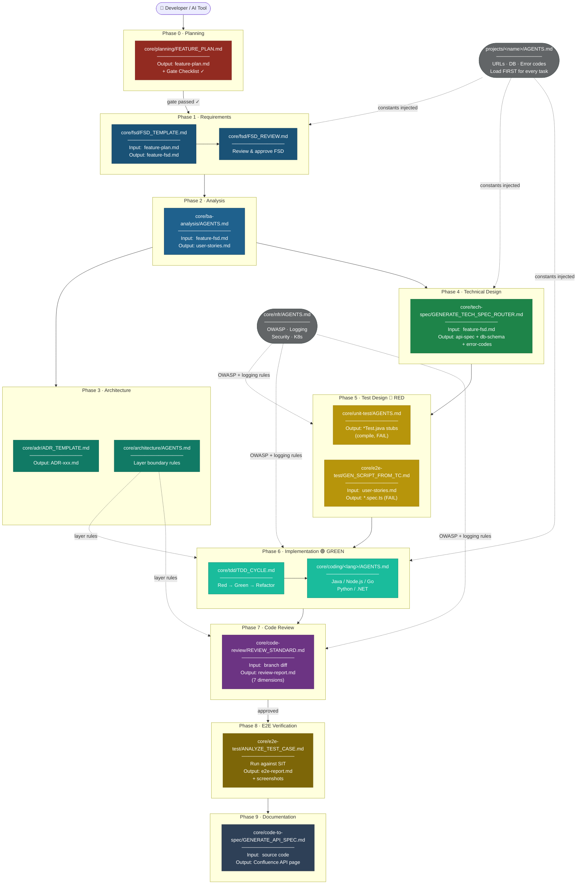

# Multi-Agent AI Automation Framework

A structured, reusable library of AI agent definitions, prompt files, and project-specific configurations for automating software engineering tasks across multiple projects.

**New here? Start with [QUICKSTART.md](QUICKSTART.md) — onboard your project in under 10 minutes.**

---

## Directory Layout

```
agent-framework/
├── core/                        # Project-agnostic agents and prompts
│   ├── planning/                # Planning Gate — feature plan + gate checklist (step 0)
│   ├── adr/                     # Architecture Decision Records (template, review, query)
│   ├── architecture/            # Hexagonal and Microservice pattern rules and checklists
│   ├── fsd/                     # Functional Specification Document template and review
│   ├── ba-analysis/             # Business analysis: user stories, acceptance criteria
│   ├── tech-spec/               # Technical specification generation (API, Batch, DB)
│   ├── tdd/                     # TDD workflow: Red→Green→Refactor cycle
│   ├── unit-test/               # Unit test generation (JUnit, Playwright)
│   ├── e2e-test/                # E2E test analysis, script generation
│   ├── coding/
│   │   ├── java/             # Spring Boot coding standards
│   │   ├── nodejs/           # Node.js / TypeScript / Express coding standards
│   │   ├── go/               # Go / Gin / Echo coding standards
│   │   ├── python/           # Python / FastAPI / Django coding standards
│   │   └── dotnet/           # C# / ASP.NET Core coding standards
│   ├── code-review/             # Code review standards and checklists
│   ├── code-to-spec/            # Generate Confluence specs from source code
│   ├── dependency-update/       # Automated Java dependency update process
│   ├── nfr/                     # NFR: logging, OWASP Top 10 (Web + API), security, K8s
│   └── tech-stack/              # Language-agnostic architecture patterns
│
├── projects/
│   └── acme-pay/                # Example: ACME payment processing system (Java + React)
│       ├── AGENTS.md            # Master entry point — shared constants for all services
│       ├── services/
│       │   └── <service>/AGENTS.md  # Per-service: language, package, coding agent
│       ├── frontend/AGENTS.md   # React 18 / TypeScript / MUI v6
│       ├── fsd/                 # Feature Plans and Functional Specification Documents
│       ├── e2e-test/            # Project-specific E2E config and scripts
│       └── tech-spec/           # Project-specific tech spec router and templates
│
├── integrate-agent/             # Tool integration guides
│   ├── SHARED_SETUP.md          # Git submodule setup — shared by all tool guides
│   ├── claude-code/             # Claude Code (CLI / IDE extension)
│   ├── github-copilot/          # GitHub Copilot Chat (VS Code / JetBrains)
│   ├── openai-codex/            # OpenAI Codex / ChatGPT (API + chat UI)
│   └── generic-llm/             # Any LLM — portable baseline + tool comparison
│
├── shared/
│   └── templates/               # Shared HTML/XML templates across projects
│
└── onboard.sh                   # Project scaffold wizard (new project + add-service)
```

---

## Architecture in Plain Language

Three layers, one rule: **generic logic lives in `core/`, project-specific data lives in `projects/`, shared assets live in `shared/`.**

- **`core/`** — prompt files that work for *any* project. No table names, no service URLs, no error codes hardcoded. Uses `{{PLACEHOLDER}}` variables instead.
- **`projects/<name>/`** — fills those placeholders with real values per project. Two levels: a root `AGENTS.md` for shared constants (URLs, DB, error prefix), and one `services/<name>/AGENTS.md` per backend service for language-specific placeholders. Extends core, never duplicates it.
- **`shared/`** — HTML/MD templates reused across projects.
- **`integrate-agent/`** — wires the framework into Claude Code, Copilot, OpenAI API, or any LLM.

When a new team onboards, they run `./onboard.sh` — it scaffolds their project folder, fills placeholders, and adds one `services/<name>/AGENTS.md` per service for any mix of languages (Java, Node.js, Go, Python, .NET). The `core/` prompts need zero changes.

---

## SDLC Process Map

This framework maps directly to the Software Development Life Cycle. Every SDLC phase has a corresponding set of prompts, context files, and outputs.

### Phase Overview

| # | SDLC Phase | Framework Module | Key Prompt File | Output |
|---|---|---|---|---|
| 0 | **Planning** | `core/planning/` | `FEATURE_PLAN.md` | Feature Plan + Gate Checklist |
| 1 | **Requirements** | `core/fsd/` | `FSD_TEMPLATE.md` | Functional Specification Document |
| 2 | **Analysis** | `core/ba-analysis/` | `AGENTS.md` | User Stories + Acceptance Criteria |
| 3 | **Architecture** | `core/adr/` + `core/architecture/` | `ADR_TEMPLATE.md` | Architecture Decision Records |
| 4 | **Technical Design** | `core/tech-spec/` | `GENERATE_TECH_SPEC_ROUTER.md` | API / Batch / DB Technical Spec |
| 5 | **Test Design (RED)** | `core/unit-test/` + `core/e2e-test/` | `AGENTS.md` / `GEN_SCRIPT_FROM_TC.md` | Failing test stubs (unit + E2E) |
| 6 | **Implementation (GREEN)** | `core/coding/<lang>/` + `core/tdd/` | `TDD_CYCLE.md` | Production source code |
| 7 | **Code Review** | `core/code-review/` + `core/nfr/` | `REVIEW_STANDARD.md` | Review report (7 dimensions) |
| 8 | **E2E Verification** | `core/e2e-test/` | `GEN_SCRIPT_FROM_TC.md` | PASS/FAIL E2E report + screenshots |
| 9 | **Documentation** | `core/code-to-spec/` | `GENERATE_API_SPEC.md` | Confluence API spec page |
| — | **NFR (cross-cutting)** | `core/nfr/` | `AGENTS.md` | Applied at phases 5, 6, 7 |
| — | **Dependency Mgmt** | `core/dependency-update/` | `AGENTS.md` | Bumped versions across repos |

### SDLC Flow Diagram



**Legend:**
| Colour | SDLC Phase |
|---|---|
| 🔴 Red | Phase 0 — Planning Gate (mandatory start) |
| 🔵 Dark blue | Phase 1 — Requirements (FSD) |
| 🔵 Mid blue | Phase 2 — Analysis (BA / User Stories) |
| 🟢 Dark green | Phase 3 — Architecture (ADR) |
| 🟢 Green | Phase 4 — Technical Design (Tech Spec) |
| 🟡 Amber | Phase 5 — Test Design RED |
| 🩵 Teal | Phase 6 — Implementation GREEN |
| 🟣 Purple | Phase 7 — Code Review |
| 🟤 Brown | Phase 8 — E2E Verification |
| ⚫ Navy | Phase 9 — Documentation |
| ⚫ Grey | Cross-cutting (NFR, Project constants) |

### How to Read the Diagram

1. Every feature **starts at Phase 0** (Planning Gate) — no FSD, no code until the gate passes.
2. The **grey nodes** (Project constants + NFR) are loaded alongside every phase — they supply values and rules without being a phase themselves.
3. Each node shows: the **prompt file to run**, the **input it needs**, and the **output it produces**.
4. Solid arrows = sequential flow. Dashed arrows = context injected into that phase.

---

## TDD Workflow — End-to-End

The framework follows a strict **Plan → Spec → Test → Code** sequence enforced by the Planning Gate. Tests are written and committed **before** production code.

Full sequence:

```
Phase 0: Planning Gate  →  Feature Plan + Gate Checklist
Phase 1: FSD            →  Functional Specification Document
Phase 2: BA Analysis    →  User Stories + Acceptance Criteria
Phase 3: Architecture   →  ADR + Layer Boundary Rules
Phase 4: Tech Spec      →  API / DB / Batch Technical Spec
Phase 5: Test Design    →  Failing unit + E2E test stubs  🔴 RED
Phase 6: Implement      →  Production code (make tests pass) 🟢 GREEN + REFACTOR
Phase 7: Code Review    →  7-dimension review report
Phase 8: E2E Run        →  PASS/FAIL report + screenshots
Phase 9: Docs           →  Confluence API spec page
```

See [`core/planning/AGENTS.md`](core/planning/AGENTS.md) for the gate checklist and [`core/tdd/AGENTS.md`](core/tdd/AGENTS.md) for the full phase-by-phase breakdown.

---

## How to Use

Every task follows the same pattern regardless of AI tool:

1. **Plan** — run `core/planning/FEATURE_PLAN.md`, pass the gate checklist
2. **Load** `projects/<your-project>/AGENTS.md` — always first; defines all shared constants
3. **Load** `projects/<your-project>/services/<name>/AGENTS.md` — for service-specific tasks
4. **Run** the target prompt file from `core/<module>/`

Identify the right prompt from the Agent Index below, then follow the tool-specific guide in `integrate-agent/` for the exact syntax.

---

## Agent Index

### Core Agents (project-agnostic)

| Agent | Path | Use When |
|---|---|---|
| **Planning Gate** | [`core/planning/AGENTS.md`](core/planning/AGENTS.md) | **Start every feature here** — produce Feature Plan, pass gate checklist before FSD |
| ADR | [`core/adr/AGENTS.md`](core/adr/AGENTS.md) | Author, review, or query Architecture Decision Records |
| Architecture | [`core/architecture/AGENTS.md`](core/architecture/AGENTS.md) | Enforce Hexagonal or Microservice layer boundaries during design, coding, and review |
| FSD | [`core/fsd/AGENTS.md`](core/fsd/AGENTS.md) | Author or review a Functional Specification Document — requires Planning Gate to pass first |
| BA Analysis | [`core/ba-analysis/AGENTS.md`](core/ba-analysis/AGENTS.md) | Transform FSD into user stories and acceptance criteria |
| Tech Spec | [`core/tech-spec/AGENTS.md`](core/tech-spec/AGENTS.md) | Generate API, Batch, or Database technical specifications from FSD |
| TDD | [`core/tdd/AGENTS.md`](core/tdd/AGENTS.md) | Run Red→Green→Refactor cycle; enforce test-first development |
| Unit Test | [`core/unit-test/AGENTS.md`](core/unit-test/AGENTS.md) | Generate JUnit 5 backend tests or Playwright frontend tests |
| E2E Test | [`core/e2e-test/AGENTS.md`](core/e2e-test/AGENTS.md) | Analyze test cases and generate Playwright scripts |
| Java Coding | [`core/coding/java/AGENTS.md`](core/coding/java/AGENTS.md) | Write new Spring Boot code following project standards |
| Node.js Coding | [`core/coding/nodejs/AGENTS.md`](core/coding/nodejs/AGENTS.md) | Write new Node.js / TypeScript code following project standards |
| Go Coding | [`core/coding/go/AGENTS.md`](core/coding/go/AGENTS.md) | Write new Go service code following project standards |
| Python Coding | [`core/coding/python/AGENTS.md`](core/coding/python/AGENTS.md) | Write new Python service code following project standards |
| .NET Coding | [`core/coding/dotnet/AGENTS.md`](core/coding/dotnet/AGENTS.md) | Write new C# / ASP.NET Core code following project standards |
| Code Review | [`core/code-review/AGENTS.md`](core/code-review/AGENTS.md) | Review a branch for performance, code smell, security, and test coverage |
| Code to Spec | [`core/code-to-spec/AGENTS.md`](core/code-to-spec/AGENTS.md) | Generate a Confluence API spec from existing source code |
| Dependency Update | [`core/dependency-update/AGENTS.md`](core/dependency-update/AGENTS.md) | Automatically update Java library versions across multiple repos |
| NFR | [`core/nfr/AGENTS.md`](core/nfr/AGENTS.md) | Non-Functional Requirements: logging, OWASP Top 10 (Web + API), security, Kubernetes |
| Tech Stack | [`core/tech-stack/AGENTS.md`](core/tech-stack/AGENTS.md) | Language-agnostic architecture patterns (Handler→UseCase→Step, API envelope, cloud-agnostic rule) |

### Example Project Agents (acme-pay)

| Agent | Path | Use When |
|---|---|---|
| acme-pay Master | [`projects/acme-pay/AGENTS.md`](projects/acme-pay/AGENTS.md) | Starting point for any acme-pay task — load first |
| acme-pay Backend | [`projects/acme-pay/backend/AGENTS.md`](projects/acme-pay/backend/AGENTS.md) | Write or review Spring Boot backend code |
| acme-pay Frontend | [`projects/acme-pay/frontend/AGENTS.md`](projects/acme-pay/frontend/AGENTS.md) | Write or review React frontend code |
| acme-pay Tech Spec | [`projects/acme-pay/tech-spec/ACMEPAY_TECH_SPEC_ROUTER.md`](projects/acme-pay/tech-spec/ACMEPAY_TECH_SPEC_ROUTER.md) | Generate API, Batch, or DB technical specs and Confluence pages |
| acme-pay E2E Test | [`projects/acme-pay/e2e-test/ACMEPAY_E2E_CONFIG.md`](projects/acme-pay/e2e-test/ACMEPAY_E2E_CONFIG.md) | Run Playwright tests and update Excel results |

### Tool Integration

| Tool | Guide | Use When |
|---|---|---|
| Claude Code | [`integrate-agent/claude-code/GUIDE.md`](integrate-agent/claude-code/GUIDE.md) | Agentic multi-file edits, hooks, CI via `claude -p` |
| GitHub Copilot | [`integrate-agent/github-copilot/GUIDE.md`](integrate-agent/github-copilot/GUIDE.md) | Inline editor chat with `#file:` and `@workspace` |
| OpenAI / ChatGPT | [`integrate-agent/openai-codex/GUIDE.md`](integrate-agent/openai-codex/GUIDE.md) | API automation pipelines or ChatGPT chat UI |
| Any LLM | [`integrate-agent/generic-llm/GUIDE.md`](integrate-agent/generic-llm/GUIDE.md) | Portable baseline; tool comparison table |

---

## Naming Conventions

| Artifact | Convention | Example |
|---|---|---|
| Folders | kebab-case | `code-to-spec/`, `e2e-test/` |
| Agent files | `AGENTS.md` (uppercase) | `AGENTS.md` |
| Prompt files | `UPPER_SNAKE_CASE.md` | `GENERATE_API_TECH_SPEC.md` |
| HTML templates | kebab-case | `confluence-template-api.html` |

---

## Onboarding a New Project or Core Module

Run `./onboard.sh` to scaffold a new project interactively — it creates the folder structure, fills all placeholders, generates one `services/<name>/AGENTS.md` per service (any language mix), and adds the project to `.gitignore`. To add a service to an existing project later: `./onboard.sh add-service <project>`.

Adding a new core module: create `core/<module-name>/AGENTS.md` + at least one `UPPER_SNAKE_CASE.md` prompt using `{{PLACEHOLDERS}}` only, then test with two different project contexts before committing. See [QUICKSTART.md](QUICKSTART.md) for details.
