# Multi-Agent AI Automation Framework

A structured, reusable library of AI agent definitions, prompt files, and project-specific configurations for automating software engineering tasks across multiple projects.

---

## Directory Layout

```
agent-framework/
├── core/                        # Project-agnostic agents and prompts
│   ├── fsd/                     # Functional Specification Document template and review
│   ├── ba-analysis/             # Business analysis: user stories, acceptance criteria
│   ├── tech-spec/               # Technical specification generation (API, Batch, DB)
│   ├── tdd/                     # TDD workflow: Red→Green→Refactor cycle
│   ├── unit-test/               # Unit test generation (JUnit, Playwright)
│   ├── e2e-test/                # E2E test analysis, script generation
│   ├── developer-coding/        # Spring Boot development coding standards
│   ├── code-review/             # Code review standards and checklists
│   ├── code-to-spec/            # Generate Confluence specs from source code
│   ├── dependency-update/       # Automated Java dependency update process
│   ├── nfr/                     # Non-Functional Requirements standards (logging, security, K8s)
│   └── tech-stack/              # Reference technology stack and architectural patterns
│
├── projects/
│   └── acme-pay/                # Example: ACME payment processing system
│       ├── AGENTS.md            # Master entry point for acme-pay
│       ├── fsd/                 # Functional Specification Documents for this project
│       ├── backend/             # Spring Boot 3 / Java 17 backend
│       ├── frontend/            # React 18 / TypeScript / MUI v6 frontend
│       ├── e2e-test/            # Project-specific E2E config and scripts
│       └── tech-spec/           # Project-specific tech spec prompts
│           └── templates/       # Confluence HTML templates
│
├── integrate-agent/             # Tool integration guides
│   ├── claude-code/             # Claude Code (CLI / IDE extension)
│   ├── github-copilot/          # GitHub Copilot Chat (VS Code / JetBrains)
│   ├── openai-codex/            # OpenAI Codex / ChatGPT (API + chat UI)
│   └── generic-llm/             # Any LLM — portable baseline + tool comparison
│
└── shared/
    └── templates/               # Shared HTML/XML templates across projects
```

---

## Architecture in Plain Language

Three layers, one rule: **generic logic lives in `core/`, project-specific data lives in `projects/`, shared assets live in `shared/`.**

- **`core/`** — prompt files that work for *any* project. No table names, no service URLs, no error codes hardcoded. Uses `{{PLACEHOLDER}}` variables instead.
- **`projects/acme-pay/`** — fills those placeholders with real project values: database table names, error codes, Confluence space keys. Extends core, never duplicates it.
- **`shared/`** — HTML/MD templates and the data dictionary used by both layers.
- **`integrate-agent/`** — shows how to wire the framework into Claude Code, Copilot, OpenAI API, or any LLM.

When another team onboards (e.g., `projects/trade-finance/`), they copy the `projects/acme-pay/` pattern and fill it with their own constants. The `core/` prompts need zero changes.

---

## Context & Navigation Map

The diagram below shows how every prompt file in the framework connects. Arrows mean "load this context before running" or "routes to". Dashed arrows mean "reads for schema reference".

```mermaid
graph TD
    DEV([Developer / AI Tool])
    DEV -->|every project task starts here| MASTER["projects/acme-pay/AGENTS.md\nMaster Entry Point"]

    subgraph PROJECT["projects/acme-pay/"]
        MASTER --> BE_A["backend/AGENTS.md"]
        MASTER --> FE_A["frontend/AGENTS.md"]
        MASTER --> E2E_CFG["e2e-test/ACMEPAY_E2E_CONFIG.md"]
        MASTER --> ROUTER["tech-spec/ACMEPAY_TECH_SPEC_ROUTER.md"]

        BE_A --> BE_UT["BE_UNIT_TEST.md"]

        FE_A --> FE_UT["FE_UNIT_TEST.md"]
        FE_A --> FE_TC["FE_TEST_CASE.md"]
        FE_A --> FSD_SPEC["FSD_TO_SPEC.md"]

        ROUTER -->|api| API["ACMEPAY_API_TECH_SPEC.md"]
        ROUTER -->|batch| BATCH["ACMEPAY_BATCH_TECH_SPEC.md"]
        ROUTER -->|db| DB["ACMEPAY_DATABASE_SPEC.md"]
        ROUTER -->|sequence| PLANTUML["ACMEPAY_PLANTUML_GENERATION.md"]

        API --> CONF_API["ACMEPAY_CONFLUENCE_FROM_API_TECH_SPEC.md"]
        BATCH --> CONF_BATCH["ACMEPAY_CONFLUENCE_FROM_BATCH_TECH_SPEC.md"]

        E2E_CFG --> EXCEL["PRE_SCRIPT_EXCEL.md"]
        E2E_CFG --> PW["PRE_SCRIPT_PLAYWRIGHT.md"]
    end

    subgraph CORE["core/  —  generic, no project data"]
        REVIEW["code-review/REVIEW_STANDARD.md"]
        CODE2SPEC["code-to-spec/GENERATE_API_SPEC.md"]
        ANALYZE["e2e-test/ANALYZE_TEST_CASE.md"]
        GEN["e2e-test/GEN_SCRIPT_FROM_TC.md"]
    end

    subgraph SHARED["shared/"]
        DD["data-dictionary/datadict-acme-pay.xlsx"]
    end

    BE_A --> REVIEW
    BE_A --> CODE2SPEC
    E2E_CFG --> ANALYZE
    E2E_CFG --> GEN

    DD -.->|schema ref| API
    DD -.->|schema ref| BATCH
    DD -.->|schema ref| DB

    classDef master    fill:#1a5276,color:#fff,stroke:#154360
    classDef agentsFile fill:#2471a3,color:#fff,stroke:#1a5276
    classDef promptFile fill:#5dade2,color:#fff,stroke:#2e86c1
    classDef coreFile  fill:#27ae60,color:#fff,stroke:#1e8449
    classDef sharedFile fill:#e67e22,color:#fff,stroke:#ca6f1e

    class MASTER master
    class BE_A,FE_A,E2E_CFG agentsFile
    class BE_UT,FE_UT,FE_TC,FSD_SPEC,ROUTER,API,BATCH,DB,PLANTUML,CONF_API,CONF_BATCH,EXCEL,PW promptFile
    class REVIEW,CODE2SPEC,ANALYZE,GEN coreFile
    class DD sharedFile
```



**Legend:**
- Dark blue ([`projects/acme-pay/AGENTS.md`](projects/acme-pay/AGENTS.md)) — master entry point, always load first
- Mid blue (AGENTS.md files) — sub-module context, load before running prompts in that domain
- Light blue (prompt files inside `projects/acme-pay/`) — project-specific, contain hardcoded project constants
- Green (prompt files inside `core/`) — generic, load via `projects/acme-pay/` Required Context
- Orange (`shared/`) — schema reference, loaded on demand by tech-spec prompts

### How to Read the Diagram — Worked Examples

Each path through the diagram is a **loading order recipe**. Trace from top to bottom to know exactly which files to load before running a prompt.

---

**Example 1 — Generate an API tech spec from an FSD**

```
Developer/AI Tool
  → projects/acme-pay/AGENTS.md              (load: project URLs, error codes, Confluence space key)
  → tech-spec/ACMEPAY_TECH_SPEC_ROUTER.md    (run: paste FSD → router picks "api")
  → ACMEPAY_API_TECH_SPEC.md                 (run: generates the spec)
  → ACMEPAY_CONFLUENCE_FROM_API_TECH_SPEC.md (optional: converts spec to Confluence HTML)
  ↙ shared/data-dictionary/datadict-acme-pay.xlsx  (loaded by the spec prompt for table/column names)
```

Files to load in order: [`projects/acme-pay/AGENTS.md`](projects/acme-pay/AGENTS.md) → [`ACMEPAY_TECH_SPEC_ROUTER.md`](projects/acme-pay/tech-spec/ACMEPAY_TECH_SPEC_ROUTER.md) → [`ACMEPAY_API_TECH_SPEC.md`](projects/acme-pay/tech-spec/ACMEPAY_API_TECH_SPEC.md)

---

**Example 2 — Generate backend unit tests**

```
Developer/AI Tool
  → projects/acme-pay/AGENTS.md     (load: Usecase/Step pattern, @Autowired rules, JdbcTemplate)
  → backend/AGENTS.md               (load: Step lifecycle, Context pattern, naming rules)
  → backend/BE_UNIT_TEST.md         (run: paste Step/Usecase class → JUnit 5 tests generated)
```

Files to load in order: [`projects/acme-pay/AGENTS.md`](projects/acme-pay/AGENTS.md) → [`backend/AGENTS.md`](projects/acme-pay/backend/AGENTS.md) → [`BE_UNIT_TEST.md`](projects/acme-pay/backend/BE_UNIT_TEST.md)

---

**Example 3 — Review a code branch (uses a core/ prompt via project context)**

```
Developer/AI Tool
  → projects/acme-pay/AGENTS.md                (load: project architecture, critical overrides)
  → backend/AGENTS.md                          (load: Usecase/Step standards for the reviewer)
  → core/code-review/REVIEW_STANDARD.md        (run: generic review checklist, now project-aware)
```

Notice: the green `core/` box is reached through the mid-blue `backend/AGENTS.md` — not directly. The project context loaded earlier is what makes the generic prompt produce project-correct output.

Files to load in order: [`projects/acme-pay/AGENTS.md`](projects/acme-pay/AGENTS.md) → [`backend/AGENTS.md`](projects/acme-pay/backend/AGENTS.md) → [`core/code-review/REVIEW_STANDARD.md`](core/code-review/REVIEW_STANDARD.md)

---

**Example 4 — Set up Playwright and generate an E2E test script**

```
Developer/AI Tool
  → projects/acme-pay/AGENTS.md              (load: project URLs, auth flow, feature routes)
  → e2e-test/ACMEPAY_E2E_CONFIG.md           (load: Playwright config, MUI locators, session setup)
  → PRE_SCRIPT_PLAYWRIGHT.md                 (run: generates playwright.config.ts + auth.setup.ts)
    — then —
  → core/e2e-test/ANALYZE_TEST_CASE.md       (run: enrich Excel test case with Data Test / Test Gap / Test Step)
  → core/e2e-test/GEN_SCRIPT_FROM_TC.md      (run: generate .spec.ts from enriched Excel)
  → PRE_SCRIPT_EXCEL.md                      (run: embed screenshots + PASS/FAIL status into Excel)
```

Files to load in order: [`projects/acme-pay/AGENTS.md`](projects/acme-pay/AGENTS.md) → [`ACMEPAY_E2E_CONFIG.md`](projects/acme-pay/e2e-test/ACMEPAY_E2E_CONFIG.md) → then the specific script prompt

---

## First Time Here?

**Step 1 — Choose your AI tool**
See `integrate-agent/` → pick the sub-folder that matches your tool → follow `SETUP_GUIDE.md`.

**Step 2 — Read the AGENTS.md for the task you need**
Every module has an `AGENTS.md` that tells you: what inputs are required, which prompt file to run, and what output to expect.

**Step 3 — Fill the placeholders and run the prompt**
Open the prompt file, replace all `{{PLACEHOLDER}}` values with real ones, then send it to your AI tool.

### Worked Example — Generate an API tech spec

```
You are a technical writer for the acme-pay project.

Read: agent-framework/projects/acme-pay/AGENTS.md          ← project constants, architecture, URLs
Run:  agent-framework/projects/acme-pay/tech-spec/ACMEPAY_TECH_SPEC_ROUTER.md

Inputs:
  FSD:           [attach or paste your FSD document]
  Feature slug:  payment-gateway
  Data dict:     shared/data-dictionary/datadict-acme-pay.xlsx
```

**Output written to:**
```
output/payment-gateway/technical-spec/
  ├── api-specification.md
  ├── database-schema.md
  ├── validation-rules.md
  ├── error-codes.md
  └── sequence-diagrams.md
```

---

## How to Use

> **`core/` vs `projects/acme-pay/`:** The `core/` layer contains generic templates for onboarding new projects — no hardcoded table names, URLs, or error codes. For all **project work**, use prompts in `projects/<your-project>/` — they contain the project-specific constants (Confluence space key, base URLs, error codes, table naming). Use `core/` only when adapting the framework for a brand-new project.

### Starting a new task

1. **Identify the task type** from the Agent Index below.
2. **Open the matching AGENTS.md** — it lists required inputs and which prompt file to invoke.
3. **For project work**, start at [`projects/acme-pay/AGENTS.md`](projects/acme-pay/AGENTS.md) — it links to every prompt file for backend, frontend, tech-spec, and e2e-test tasks.
4. **Fill all `{{PLACEHOLDER}}` variables** before running the prompt. Every placeholder is documented in the module's AGENTS.md.

---

## TDD Workflow — End-to-End

The framework follows a strict **FSD → Test → Code** sequence. Each step feeds the next.

```
┌─────────────────────────────────────────────────────────────────────┐
│  1. FSD          core/fsd/FSD_TEMPLATE.md                           │
│     Write or receive the Functional Specification Document          │
└────────────────────────┬────────────────────────────────────────────┘
                         │
┌────────────────────────▼────────────────────────────────────────────┐
│  2. BA Analysis  core/ba-analysis/AGENTS.md                         │
│     Extract user stories, acceptance criteria, open questions       │
└────────────────────────┬────────────────────────────────────────────┘
                         │
┌────────────────────────▼────────────────────────────────────────────┐
│  3. Tech Spec    core/tech-spec/GENERATE_TECH_SPEC_ROUTER.md        │
│     Generate API spec, DB schema, validation rules, error codes,    │
│     sequence diagrams                                               │
└────────────────────────┬────────────────────────────────────────────┘
                         │
┌────────────────────────▼────────────────────────────────────────────┐
│  4. Test Cases   core/unit-test/AGENTS.md                           │
│     (RED)        core/e2e-test/ANALYZE_TEST_CASE.md                 │
│     Generate failing unit tests + E2E test scripts FROM the spec    │
│     ⚠️  Commit tests BEFORE writing any production code             │
└────────────────────────┬────────────────────────────────────────────┘
                         │
┌────────────────────────▼────────────────────────────────────────────┐
│  5. Implementation core/developer-coding/AGENTS.md                  │
│     (GREEN)        core/tdd/TDD_CYCLE.md                            │
│     Write minimum code to pass all failing tests                    │
│     Apply Usecase → Step pattern + NFR requirements                 │
└────────────────────────┬────────────────────────────────────────────┘
                         │
┌────────────────────────▼────────────────────────────────────────────┐
│  6. Refactor     core/tdd/TDD_CYCLE.md (Phase 3)                    │
│     Clean code, enforce naming, verify NFR compliance               │
│     All tests remain green                                          │
└────────────────────────┬────────────────────────────────────────────┘
                         │
┌────────────────────────▼────────────────────────────────────────────┐
│  7. Code Review  core/code-review/REVIEW_STANDARD.md                │
│     Review against FSD + tech spec + NFR across 7 dimensions        │
└────────────────────────┬────────────────────────────────────────────┘
                         │
┌────────────────────────▼────────────────────────────────────────────┐
│  8. E2E Report   projects/<p>/e2e-test/PRE_SCRIPT_EXCEL.md          │
│     Run Playwright tests, embed screenshots, update Excel report    │
└─────────────────────────────────────────────────────────────────────┘
```

---

## Agent Index

### Core Agents (project-agnostic)

| Agent | Path | Use When |
|---|---|---|
| FSD | [`core/fsd/AGENTS.md`](core/fsd/AGENTS.md) | Author or review a Functional Specification Document |
| BA Analysis | [`core/ba-analysis/AGENTS.md`](core/ba-analysis/AGENTS.md) | Transform FSD into user stories and acceptance criteria |
| Tech Spec | [`core/tech-spec/AGENTS.md`](core/tech-spec/AGENTS.md) | Generate API, Batch, or Database technical specifications from FSD |
| TDD | [`core/tdd/AGENTS.md`](core/tdd/AGENTS.md) | Run Red→Green→Refactor cycle; enforce test-first development |
| Unit Test | [`core/unit-test/AGENTS.md`](core/unit-test/AGENTS.md) | Generate JUnit 5 backend tests or Playwright frontend tests |
| E2E Test | [`core/e2e-test/AGENTS.md`](core/e2e-test/AGENTS.md) | Analyze test cases and generate Playwright scripts |
| Developer Coding | [`core/developer-coding/AGENTS.md`](core/developer-coding/AGENTS.md) | Write new Spring Boot code following project standards |
| Code Review | [`core/code-review/AGENTS.md`](core/code-review/AGENTS.md) | Review a branch for performance, code smell, security, and test coverage |
| Code to Spec | [`core/code-to-spec/AGENTS.md`](core/code-to-spec/AGENTS.md) | Generate a Confluence API spec from existing Spring Boot source code |
| Dependency Update | [`core/dependency-update/AGENTS.md`](core/dependency-update/AGENTS.md) | Automatically update Java library versions across multiple repos |
| NFR | [`core/nfr/AGENTS.md`](core/nfr/AGENTS.md) | Non-Functional Requirements: logging, security, cloud-agnostic design, Kubernetes |
| Tech Stack | [`core/tech-stack/AGENTS.md`](core/tech-stack/AGENTS.md) | Reference architecture and technology stack patterns |

### Example Project Agents (acme-pay)

| Agent | Path | Use When |
|---|---|---|
| acme-pay Master | [`projects/acme-pay/AGENTS.md`](projects/acme-pay/AGENTS.md) | Starting point for any acme-pay task |
| acme-pay Backend | [`projects/acme-pay/backend/AGENTS.md`](projects/acme-pay/backend/AGENTS.md) | Write or review Spring Boot backend code |
| acme-pay Frontend | [`projects/acme-pay/frontend/AGENTS.md`](projects/acme-pay/frontend/AGENTS.md) | Write or review React frontend code |
| acme-pay Tech Spec | [`projects/acme-pay/tech-spec/ACMEPAY_TECH_SPEC_ROUTER.md`](projects/acme-pay/tech-spec/ACMEPAY_TECH_SPEC_ROUTER.md) | Generate API, Batch, or DB technical specs and Confluence pages |
| acme-pay E2E Test | [`projects/acme-pay/e2e-test/ACMEPAY_E2E_CONFIG.md`](projects/acme-pay/e2e-test/ACMEPAY_E2E_CONFIG.md) | Run Playwright tests and update Excel results |

### Tool Integration

| Tool | Path | Use When |
|---|---|---|
| Claude Code | [`integrate-agent/claude-code/AGENTS.md`](integrate-agent/claude-code/AGENTS.md) | Agentic multi-file edits, hooks, CI via `claude -p` |
| GitHub Copilot | [`integrate-agent/github-copilot/AGENTS.md`](integrate-agent/github-copilot/AGENTS.md) | Inline editor chat with `#file:` and `@workspace` |
| OpenAI / ChatGPT | [`integrate-agent/openai-codex/AGENTS.md`](integrate-agent/openai-codex/AGENTS.md) | API automation pipelines or ChatGPT chat UI |
| Any LLM | [`integrate-agent/generic-llm/AGENTS.md`](integrate-agent/generic-llm/AGENTS.md) | Portable baseline; tool comparison table |

---

## Naming Conventions

| Artifact | Convention | Example |
|---|---|---|
| Folders | kebab-case | `code-to-spec/`, `e2e-test/` |
| Agent files | `AGENTS.md` (uppercase) | `AGENTS.md` |
| Prompt files | `UPPER_SNAKE_CASE.md` | `GENERATE_API_TECH_SPEC.md` |
| HTML templates | kebab-case | `confluence-template-api.html` |

---

## Quick Start Examples

**Generate an API tech spec from an FSD:**
```
1. Open projects/acme-pay/AGENTS.md — note required constants (Confluence space, URLs, error codes)
2. Run projects/acme-pay/tech-spec/ACMEPAY_TECH_SPEC_ROUTER.md — attach FSD, set feature slug
3. Router classifies FSD type (api/batch/db) and invokes the project-specific prompt automatically
4. Output written to output/<feature-slug>/technical-spec/
```

**Generate backend unit tests:**
```
1. Open projects/acme-pay/AGENTS.md + projects/acme-pay/backend/AGENTS.md — load architecture context
2. Run projects/acme-pay/backend/BE_UNIT_TEST.md — provide the Step or Usecase class name and file path
3. JUnit 5 tests generated for Controller, Usecase Impl, and each Step (target ≥ 80% coverage)
```

**Review a code branch:**
```
1. Open projects/acme-pay/AGENTS.md + projects/acme-pay/backend/AGENTS.md — load project architecture context
2. Run core/code-review/REVIEW_STANDARD.md — provide branch name and spec document
3. Review report produced covering 7 dimensions: performance, code smell, security, structure,
   mapping, business logic, test coverage
```

---

## Adding a New Project

Follow these steps when a new team wants to onboard their project.

### Step 1 — Create the project folder

```
projects/
└── <your-project>/          ← kebab-case name, e.g. payments, trade-finance
    ├── AGENTS.md            ← master entry point (required)
    ├── backend/
    │   └── AGENTS.md
    ├── frontend/
    │   └── AGENTS.md
    ├── tech-spec/
    │   ├── <PROJECT>_API_TECH_SPEC.md
    │   └── templates/
    └── e2e-test/
        └── <PROJECT>_E2E_CONFIG.md
```

Only create sub-folders for domains your project actually uses. A backend-only project needs only `backend/`.

### Step 2 — Write `projects/<your-project>/AGENTS.md`

This is the single entry point an AI tool reads before any task. It must contain:

| Section | What to write |
|---|---|
| **System context** | Tech stack, team, key architectural decisions |
| **Placeholder values** | The real values that replace `{{PLACEHOLDERS}}` in core/ prompts |
| **Sub-module map** | Links to backend/, frontend/, tech-spec/, e2e-test/ AGENTS.md |
| **Do NOT** list | Things the AI should never do for this project |

Use [`projects/acme-pay/AGENTS.md`](projects/acme-pay/AGENTS.md) as the reference template.

### Step 3 — Define your project-specific constants

Create a constants block inside `projects/<your-project>/AGENTS.md` (or a separate `CONSTANTS.md`) covering:

- **Database**: schema name, key table names, naming conventions
- **Error codes**: format and prefix (e.g., `PAY001`, `TRD001`)
- **API base path**: e.g., `/api/payments/v1/`
- **Confluence space key** and parent page ID
- **Environment URLs**: SIT, UAT, PROD base URLs for E2E tests
- **Auth setup**: SSO provider, session file location

### Step 4 — Write sub-module AGENTS.md files

For each sub-folder, write an `AGENTS.md` that:
- States the sub-domain purpose in one sentence
- Lists which `core/` prompt files apply (reference by path)
- Documents any project-specific overrides or additions to the core prompt

### Step 5 — Add project-specific prompt files (if needed)

If a core/ prompt doesn't cover your project's needs exactly, create a project-specific override:

```
projects/<your-project>/tech-spec/<PROJECT>_API_TECH_SPEC.md
```

Structure it as: *"Run `core/tech-spec/GENERATE_API_TECH_SPEC.md`, then apply these additional rules: ..."*

Do not copy-paste the entire core prompt — reference it and extend it.

### Step 6 — Add Confluence templates (if applicable)

If your project publishes specs to Confluence, add your HTML templates:

```
projects/<your-project>/tech-spec/templates/
  ├── confluence-template-api.html
  └── confluence-template-batch.html
```

Base them on `shared/templates/confluence-template-base.html`.

### Step 7 — Update this README

Add your project to the Agent Index table under "Example Project Agents":

```markdown
| <Your Project> Master | `projects/<your-project>/AGENTS.md` | Starting point for any <project> task |
```

### Quality Gate Before Publishing

- [ ] `projects/<your-project>/AGENTS.md` exists and has all sections (System context, Placeholder values, Sub-module map)
- [ ] All placeholder values documented (replaces every `{{PLACEHOLDER}}` in the core prompts you use)
- [ ] Sub-module AGENTS.md files written for each used domain
- [ ] At least one prompt tested end-to-end with real input
- [ ] README Agent Index updated

---

## Adding a New Core Module

When you identify a recurring task that no existing core module covers (e.g., `data-migration/`, `security-review/`):

1. Create `core/<module-name>/` in kebab-case
2. Write `core/<module-name>/AGENTS.md` following the standard template
3. Write at least one `UPPER_SNAKE_CASE.md` prompt file — use `{{PLACEHOLDERS}}`, no project-specific data
4. Test with two different inputs before publishing
5. Update this README Agent Index and the Naming Conventions table if needed
