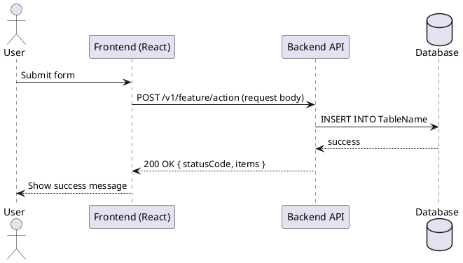

# AGENTS.md — Business Analysis

## Purpose

Transform raw requirements (FSD documents, Confluence pages, meeting notes, or informal descriptions) into structured artefacts:
- User stories (As a / I want / So that)
- Acceptance criteria (Given / When / Then)
- Data-flow diagrams (textual or PlantUML)
- Glossary of domain terms
- Open questions and risk flags

---

## When to Use

Use this agent when you need to:
- Break down a functional specification into backlog-ready user stories
- Define clear acceptance criteria before development begins
- Identify data flows, actors, and system boundaries from an FSD
- Produce a domain glossary for alignment across teams

---

## Prompt Files

| File | Purpose |
|---|---|
| _(no standalone prompt file — instructions are inline below)_ | Follow the steps directly in this AGENTS.md |

---

## Standard Inputs

| Input | Format | Required |
|---|---|---|
| Raw requirement document | `.pdf`, `.docx`, `.md`, or plain text | Yes |
| Project context (system name, tech stack) | Brief description or `AGENTS.md` | Recommended |
| Persona / role list | Plain text list | Optional |
| Existing glossary | `.md` or plain text | Optional |

---

## Outputs

| Output | Description |
|---|---|
| `user-stories.md` | Numbered list of user stories with acceptance criteria |
| `data-flow.md` | Data-flow description or PlantUML activity/sequence diagram |
| `glossary.md` | Domain term definitions |
| `open-questions.md` | Ambiguities, risks, and questions requiring stakeholder input |

---

## Process Steps

### Step 1 — Read the Requirement Document

Read the provided document end-to-end. Extract:
- **Actors / Personas** — who uses or interacts with the system
- **Business Goals** — what outcome the feature delivers
- **Functional Requirements** — what the system must do
- **Non-Functional Requirements** — performance, security, compliance
- **Constraints** — deadlines, regulatory, technology

### Step 2 — Identify User Stories

For each functional requirement, write a user story in this format:

```
US-NNN: [Title]
As a [persona],
I want to [action],
So that [business outcome].

Priority: High | Medium | Low
Story Points: [estimate]
```

Rules:
- One story per distinct user goal — do not bundle multiple goals
- Write from the user's perspective, not the system's
- If the requirement is vague, write the story as best understood and flag it in `open-questions.md`

### Step 3 — Write Acceptance Criteria

For each user story, write acceptance criteria in Gherkin format:

```
Scenario: [Scenario name]
Given [precondition]
When [action]
Then [expected outcome]
And [additional assertions if needed]
```

Rules:
- Minimum 2 scenarios per story: happy path + one failure/edge case
- Use specific, testable language — avoid "should work correctly"
- For UI features, describe visible behavior (button state, message text, navigation)
- For API features, describe request/response contract and error codes

### Step 4 — Draw Data Flow

Produce a textual or PlantUML description of how data moves through the system:



Identify:
- Entry points (user actions, scheduled triggers, external events)
- Data transformations (validation, enrichment, calculation)
- Persistence points (which tables are read/written)
- Exit points (API responses, events, notifications)

### Step 5 — Build Glossary

Define every domain term, acronym, and status code that appears in the requirements:

```markdown
| Term | Definition |
|---|---|
| {{TERM}} | {{DEFINITION}} |
```

### Step 6 — List Open Questions

Flag every ambiguity, assumption, or risk:

```markdown
| ID | Question | Raised By | Priority | Status |
|---|---|---|---|---|
| OQ-001 | {{QUESTION}} | BA Agent | High | Open |
```

---

## Dependencies

- None — this agent works from document input only
- If a project AGENTS.md exists, read it first to understand domain terminology and tech stack

---

## DO NOT

- Do not invent business rules not present in the source document
- Do not write implementation details in user stories — keep them business-facing
- Do not mix acceptance criteria into the user story description
- Do not produce output files unless the user explicitly requests them saved
