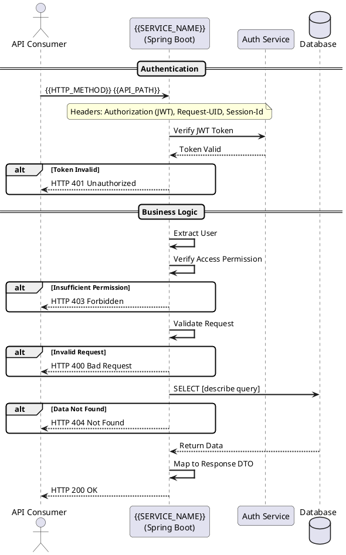

# Generate API Specification from Source Code

## Required Context

Load these files before running this prompt:

| File | Purpose |
|---|---|
| `agent-framework/projects/acme-pay/AGENTS.md` | Project API base path, Confluence space, error codes |
| `agent-framework/projects/acme-pay/backend/AGENTS.md` | Project Usecase/Step pattern — the spec traces this call chain |

> Replace the paths above with your own project's AGENTS.md files.
> If you have not loaded the files above, stop and load them first.
> The instructions below assume that context is already present.

---

## Task Overview

Generate a complete API specification document for a specific endpoint by reading the project's source code and filling in a Confluence HTML template. All values must be extracted from actual code — never invented.

---

## Input Information

**User will provide:**
- HTTP Method: `{{HTTP_METHOD}}` (e.g., POST, GET, PUT, DELETE)
- API Path: `{{API_PATH}}` (e.g., `/api/{{PROJECT}}/v1/feature/action`)
- Controller file path
- Project AGENTS.md path
- Confluence HTML template path

**AI must automatically detect and analyze:**

1. **Controller Method** — Find the `@PostMapping` / `@GetMapping` annotation matching the path; extract method name
2. **Request DTO** — From the `@RequestBody` or `@RequestPart` parameter in the controller method
3. **Response DTO** — From the controller method return type generic parameter
4. **Usecase Class** — From the controller method body; trace to Usecase implementation
5. **All Steps** — Open the Usecase implementation; analyze the pipeline execution (`.andThen()`, `.map()`, `.flatMap()`); extract all Step classes in pipeline order
6. **Architecture Guide** — Read the project's AGENTS.md before reading any other file

**Example Detection Flow:**
```
User provides: POST /api/{{PROJECT}}/v1/block-word/search

AI detects:
1. Controller: [Feature]Controller.blockWordSearch()
2. Request DTO: [Feature]BlockWordSearchRequest
3. Response DTO: [Feature]BlockWordSearchResponse
4. Usecase: [Feature]BlockWordSearchUsecaseImpl
5. Steps: [UserStep, VerifyAccessFunctionStep, BlockWordSearchGetDataStep, BlockWordSearchMappingResponseStep]
```

---

## Analysis Steps

### Step 1: Analyze Controller
Read the controller method to understand:
- HTTP method and path
- Request/Response types
- Headers required (e.g., `{{REQUEST_HEADER_CLASS}}`)
- Which Usecase is called

### Step 2: Analyze Usecase
Read the Usecase implementation to understand:
- Pipeline execution flow (Vavr Try monad or equivalent)
- All Steps executed in order
- Transaction scope
- Error handling strategy

### Step 3: Analyze Each Step
For each Step in the pipeline:
- Step name and purpose
- What it does (validation, data access, external API call, etc.)
- Which Services / Repositories it uses
- Async or sync execution

### Step 4: Analyze Request DTO
For each field in the Request DTO:
- Field name and Java type
- Validation annotations: `@NotBlank`, `@NotNull` → Required; `@Size(max=N)` → Max length; `@Digits(integer=M, fraction=D)` → Number precision; `@Pattern(regexp="...")` → Pattern
- Description from `@Schema(description="...")`

### Step 5: Analyze Response DTO
For each field in the Response DTO:
- Field name and Java type
- Description from `@Schema(description="...")`
- Nested objects and arrays (each needs a separate sub-section)

**Database Mapping Verification:**

For each response field that comes from the database:
1. Trace from Step → Service → Repository → Entity/RowMapper
2. Read `@Table(name = "...")` → exact table name
3. Read `@Column(name = "...")` or RowMapper `rs.getString("ColumnName")` → exact column name
4. Document as `TableName.ColumnName` (use EXACT casing)
5. Never assume snake_case or camelCase — always verify from code

**Verification Checklist:**
- Read actual Entity class or RowMapper file
- Extract exact `@Table(name = "...")` value
- Extract exact column names from `@Column` annotations or `rs.getString(...)` calls
- Use exact casing in documentation
- Verify SQL queries use correct table/column names

### Step 6: Identify External API Calls
- Which external systems are called (from Service/Client classes)
- API names and purposes
- Error handling for external failures

---

## Critical Script Generation Rules

### 1. Variable Definition and Replacement Order
- Define ALL variables BEFORE replacing placeholders
- Replace each placeholder ONLY ONCE
- Never replace a placeholder twice

### 2. Template Section Preservation
- Do NOT delete nested array sections — they are templates for sub-sections
- Do NOT use regex to remove entire sections unless 100% sure they are not needed
- Preserve all `ac:local-id` and `local-id` attributes from the template

### 3. Placeholder Replacement Strategy
**Recommended order:**
1. Define all constants and SQL queries first
2. Generate all dynamic content (scope rows, validation rows, field rows)
3. Replace all placeholders in a single pass

---

## Placeholder Mapping Rules

### Document Information Section

| Placeholder | Value |
|---|---|
| `{{CURRENT_DATE}}` | Today's date in format: `YYYY-MM-DD` |
| `{{API_NAME}}` | Human-readable API name (e.g., `Block Word Search`) |
| `{{MethodName}}` | HTTP method (e.g., `POST`, `GET`) |
| `{{Endpoint}}` | Full API path (e.g., `/api/{{PROJECT}}/v1/block-word/search`) |

### Executive Summary — `{{OVERVIEW_API}}`
Brief 2–3 sentence description of what this API does.

### Scope Section — `{{SCOPE_ROWS}}`
Generate HTML table rows from:
1. Request DTO validation annotations
2. Business rules in Steps
3. Authorization requirements from verify-access Steps
4. Transaction scope
5. Audit/logging requirements

**Output format:**
```html
<tr ac:local-id="scope-row-1"><td ac:local-id="scope-cell-1-1"><p local-id="scope-p-1-1">1</p></td><td ac:local-id="scope-cell-1-2"><p local-id="scope-p-1-2">Field X is mandatory for all requests</p></td></tr>
```

### Functional Overview — `{{FUNCTION_OVERVIEW}}`
Bullet-point list of API features. Extract from Step names and business operations. Start each item with an action verb (Validate, Save, Retrieve, Generate, etc.).

### Data Validation Rules — `{{VALIDATION_ROWS}}`
One HTML `<tr>` row per JSR-380 validation annotation found in the Request DTO:

| Column | Source |
|---|---|
| Field Name | DTO field name |
| Validation Rule | Derived from annotation (`@NotBlank` → "Required", `@Size(max=N)` → "Max length N") |
| Error Code | From exception class or constant file |
| Error Message | Descriptive message matching the validation |

### Sequence Diagram — `{{SEQUENCE_DIAGRAM_PUML}}`

Select the pattern based on the Usecase pipeline:

**Pattern 1 — Read-Only Query** (no DB writes, no external APIs):


**Pattern 2 — Database Write** (INSERT/UPDATE/DELETE, no external APIs):
Extend Pattern 1 with write operations. Replace `SELECT` with `INSERT/UPDATE/DELETE` and add `Database Error` alt block.

**Pattern 3 — External Service** (calls Murex, CBS, TLM, Config, etc.):
Add external service participant. Wrap external call in `opt` block with error handling.

**Pattern 4 — Bulk/Async** (file upload, file download, batch processing):
Add `Azure Blob Storage` or equivalent participant. Use `loop` block for batch processing.

**Decision guide:**
- Does the API call external systems? → Pattern 3 or 4
- Does the API write to DB? → Pattern 2
- Does the API only read? → Pattern 1
- Does the API process files? → Pattern 4

### Request Parameters — Section 4.2
Generate:
1. Request headers table (Authorization, Request-UID, Session-Id, Crypto, and any custom headers)
2. Request body JSON block with realistic example values

**Realistic value guidelines:**
- Customer ID: `CUST001234`
- Amount: `50000.00`
- Currency: `THB`, `USD`, `EUR`
- Date: `2024-03-15`
- Status: `PENDING`, `APPROVED`, `ACTIVE`

### Response Fields — Section 4.3
For top-level primitive fields: document fully (name, type, required, description, DB mapping, example).

For nested objects and arrays: show type `Object` or `Array<Object>` in main table; reference sub-section (e.g., "See section 4.3.1"). Create separate sub-section for each nested structure.

**Section numbering:** 4.3 (main) → 4.3.1 → 4.3.2 → 4.3.3 (each nested structure)

### SQL Queries — `{{REQUEST_SQL_EXAMPLE}}` and `{{NESTED_SQL_EXAMPLE}}`
Generate SQL from Repository methods. Organize into three sections:
1. MAIN FIELD QUERIES — populates top-level response fields
2. NESTED FIELD QUERIES — populates nested objects/arrays
3. INSERT/UPDATE QUERIES — data modification (if applicable)

For each query, add comment: `-- Populates: fieldName.nestedField`

### OpenAPI 3.0 YAML — `{{API_SWAGGER}}`
Generate complete OpenAPI 3.0 YAML including:
- `info`: title, version, description
- `servers`: dev, sit, uat, prod environments
- `paths`: method, parameters (headers), requestBody, responses (200, 400, 401, 403, 404, 500)
- `components/schemas`: Request DTO, Response DTO, wrapper format

### API Error Rows — `{{API_ERROR_ROWS}}`

**Step 1:** Analyze exception classes in the exception/ package
**Step 2:** Analyze constant classes for error codes and messages
**Step 3:** For each Step in the pipeline, identify what exception it throws

**Standard error codes (always include):**
- `JWT000` (401) — JWT Token Missing
- `JWT001` (401) — JWT Token Expired
- `JWT002` (401) — JWT Token Invalid Signature
- `JWT003` (401) — JWT Token Malformed
- `USER000` (404) — User Not Found
- `AUTH001` (403) — Insufficient Permissions
- `S0001` (400) — Request Body Validation Error

**Feature-specific errors:** Extract from constant files and exception throw sites.

**Error row format:**
```html
<tr ac:local-id="err-row-N">
  <td ac:local-id="err-cell-N-1"><p local-id="err-p-N-1">ERROR_CODE</p></td>
  <td ac:local-id="err-cell-N-2"><p local-id="err-p-N-2">HTTP_STATUS</p></td>
  <td ac:local-id="err-cell-N-3"><p local-id="err-p-N-3">Description</p></td>
  <td ac:local-id="err-cell-N-4"><p local-id="err-p-N-4">When it occurs</p></td>
  <td ac:local-id="err-cell-N-5">
    <ac:structured-macro ac:name="code" ac:schema-version="1">
      <ac:parameter ac:name="language">json</ac:parameter>
      <ac:plain-text-body><![CDATA[{
  "statusCode": "HTTP_STATUS",
  "errors": [{"code": "ERROR_CODE", "description": "...", "message": "...", "moreInfo": "...", "severitylevel": "Error"}]
}]]></ac:plain-text-body>
    </ac:structured-macro>
  </td>
</tr>
```

---

## Output Format

Generate the complete Confluence Storage Format (XHTML) by:

1. **Read Template** — Load the Confluence HTML template
2. **Replace Placeholders** — Replace ALL `{{...}}` placeholders with actual values from code
3. **Generate Nested Sections** — For Object/Array response fields, create sub-sections (4.3.1, 4.3.2, etc.)
4. **Keep Confluence Tags** — Preserve all `ac:local-id`, `ri:page`, and other Confluence-specific attributes
5. **Format Dates** — Use YYYY-MM-DD format
6. **Realistic Examples** — Use business-realistic values (not "string", "value1", "test")
7. **PlantUML Diagrams** — Insert full PlantUML text inside `<ac:plain-text-body><![CDATA[...]]></ac:plain-text-body>`

---

## Quality Checklist

Before submitting the generated specification, verify:

- [ ] All `{{...}}` placeholders replaced — no remaining placeholders
- [ ] Type formats correct: `String(N)`, `Number(M,D)`, `Boolean`, `Object`, `Array<Type>`
- [ ] Examples are realistic — not generic values like "string", "example", "value1"
- [ ] Examples respect constraints — `String(40)` → max 40 characters
- [ ] Nested objects documented — each Object/Array has its own sub-section
- [ ] Business flow complete — shows all Steps in pipeline execution order
- [ ] Validation rules match code — extracted from JSR-380 annotations
- [ ] Database tables and columns verified — from Entity annotations or RowMapper
- [ ] External APIs documented — from Service/Client classes
- [ ] Error codes realistic — match exception classes in project
- [ ] Common errors included — JWT, User, Validation errors
- [ ] Error HTTP status codes correct — 400/401/403/404/409/500 mapped correctly
- [ ] Confluence tags intact — all `ac:local-id` and other tags preserved
- [ ] PlantUML embedded — `{{SEQUENCE_DIAGRAM_PUML}}` replaced with valid `@startuml...@enduml`
